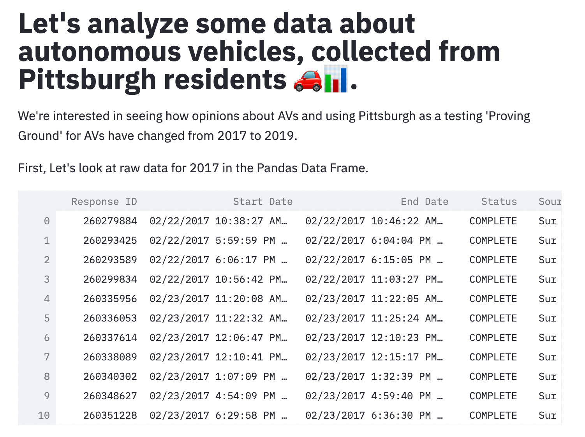

# PGH Autonomous Vehicle Perceptions Over Time

We are Jacqueline, an aerospace engineer, roboticist and pilot, and Healy, a previous UX professional for the railroad. We both are interested in the autonomous transportation space given our backgrounds, but don't have much previous experience in the world of data science or interactive visualization.  

Our goals for this project were to clearly convey the perception of autonomous vehicles' presence in Pittsburgh over a two year time period, and analyze if a longer deployment in the city would help or hurt public acceptance. We were especially interested in analyzing the effect of events such as a fatality caused by an AV deployment to see how the public reacted. Overall, this assignment was a great way for us to get our feet wet in the world of data science and both demonstrate how powerful tools like streamlit and altair are, along with how far we still have to go as students of this field. 

## Project Goals

- Compare and contrast perceptions of autonomous vehicles in Pittsburgh over a two-year time period
- Communicate points of special interest or impact to viewers 
- Allow users to select and customize which visualizations and time periods they can view and interact with
- Learn more about when and why to use specific visual encodings and interaction techniques 

## Design

It was important to us to include tooltip encodings when users moused over our visuals. We were reminded of our reading, "Toward a Deeper Understanding of the Role of Interaction in Information Visualization", which states "cognition of a user can be further amplified" by even these small interactions. We chose tooltips to quickly allow users to see descriptive qualities such as counts and labels without having to search for a legend or line up titles with the exact bar that they are representing. This tightly coupled interaction reinforces user trust and reduces cognitive load by taking some of the burden of searching for information off of them. 

We selectively used color changes as well to not overwhelm users, but emphasize important distinctions. For our chart containing information on perception after the unfortunate fatality with an AV in Arizona, we switched our chart to a bright red color to further emphasize the difference from the other chart. For users with low vision or color-blindness, we included descriptive titles to ensure the colors were not the only differentiating factor between data visualizations. 

We chose to make heavy use of bar charts, both horizontally and vertically, as in user experience research it is proven that "Bar charts are a reliable means of representing quantitative data: we pre-attentively process the length of each bar efficiently, allowing for easy comparison of values" (Nielsen-Norman Group). We wanted to ensure users were able to quickly determine standout categories and comprehend differences in quantitative data between groups.

We considered using scatterplots as well, since they are also seen as a way to play to human's strengths in processing data along a 2D plane, but we chose to stick to all bar charts due to what Nielsen-Norman calls "Jakob's Law". This was coined to explain how users come into every experience with existing mental models, so it is more efficient to recognize and mimic those existing perceptions so they can "focus on their tasks rather than on learning new models". By staying with the bar chart paradigm, users are able to focus on the differences and concepts being demonstrated by each visualization, rather than first adjusting to different formats and then having to process the data. If we had more than two years from which to pull data, it might have made more sense to include a scatter or line plot to indicate change over time, but since we only had 2 years worth of data, such a visualization would not have particularly useful to our goals.

## Development

TODO: **An overview of your development process.** Describe how the work was split among the team members. Include a commentary on the development process, including answers to the following questions: Roughly how much time did you spend developing your application (in people-hours)? What aspects took the most time?

Having worked together on a previous class project before, we luckily had a good working dynamic already figured out. We first spent time brainstorming what data set would be exciting for both of us to explore, and settled on the AV data set which Jacqueline located - this process took about two to three hours total of research and discussion. Once we knew our topic, we set out to talk about what aspects of the data piqued each of our interests, with 'perception over time' and 'perception following the Arizona crash' being the two areas that immediately jumped out. Jacqueline worked on these visualizations and kindly took the lead on early programming when Healy had an unexpected death in the family and had to leave town to attend the funeral. Locating datasets, brainstorming and sketching, and programming took her around 15 hours.

Lastly, as a cyclist herself, Healy was interested in how safe people felt cycling on roads with AVs versus cycling with humans. It was both surprising and not to find that many people actually felt safer sharing the road with AVs. This makes sense given the epidemic of drunk-driving, texting, and distraction that plagues so many human drivers these days. She worked on the comparison of safety with human drivers versus autonomous vehicles, and luckily had done the repo and initial project setup before heading home for the funeral so that it was in a good place for collaboration with Jacqueline. Overall, the project probably took her around 15 hours, with a lot of the work taking the form of looking up streamlit and altair documentation, reading about data visualization techniques, debugging, and analyzing and sketching with the AV data to understand what aspects to include in her code. 

## Success Story

The main success story of our project was learning more about data science techniques and programming. With both of us having very little experience in this field, it was a great chance to dive in to data ourselves, especially a dataset that we both found lots of interest in combing through and exploring through code. We also learned that while tools like streamlit and altair are powerful, without asking the right questions the visualizations we make would mean nothing. Finding a way to phrase questions, display data in logical ways, and building areas for interaction allows users to actually make use of our data rather than just seeing a bunch of meaningless or unlabeled charts and graphs. 

As for the actual autonomous vehicle data, it was surprising to see that the 2018 Uber Crash did not significantly impact people's opinions on AV testing, and that more people found sharing roads with AVs safer than sharing roads with human drivers. Perhaps most people understand that the 2018 Uber Crash happened still early on in the AV development process, and that in the future with years and decades of development and testing, AVs will become safer and more capable. It would be interesting to continue this project when the next years of data come in, and to do it in other cities as well where AVs are not as prevalent. 
